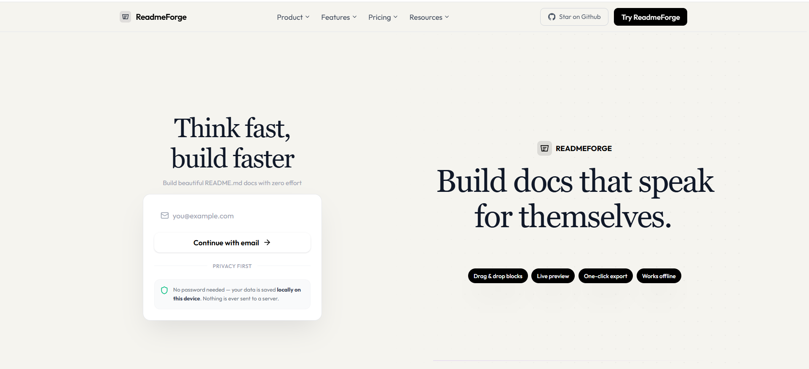
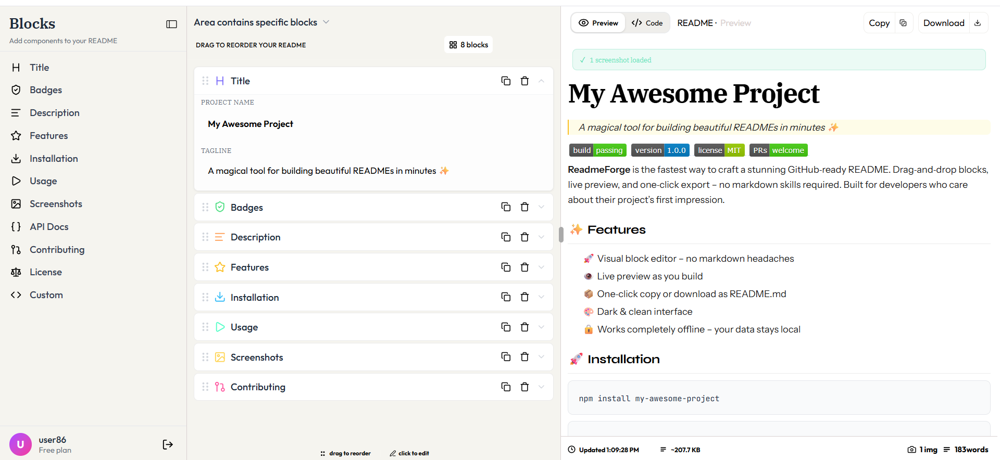

# <a href="https://thereadmeforge.vercel.app" target="_blank">ReadmeForge - Visual README Builder</a>

> Build stunning GitHub‑ready READMEs in minutes. No markdown skills needed.

<p align="left">
  
  
  
  
  <a href="https://github.com/byllzz">
    
  </a>
  
  
</p>

<br />

[](https://thereadmeforge.vercel.app)




⭐ **Star it on GitHub** if it saved you from writing yet another README from scratch.

---

## What is ReadmeForge?

ReadmeForge is a **visual, block‑based README editor** that lets you craft professional GitHub documentation without touching raw markdown. Drag, drop, reorder, and fill in content - then copy or download a perfect `README.md` with one click.

Eleven purpose‑built block types cover everything a modern open‑source project needs: from title & badges to screenshots, API docs, and contributing guides. A live preview renders exactly what GitHub will display, while the code view shows the raw markdown with full syntax highlighting.

No sign‑up. No server. No tracking. Your data is saved **locally in your browser**, keyed by any email you choose - giving you multiple isolated workspaces for different projects.

---

##  Features

**Core editor** <br>
✔️ **11 block types** - Title, Badges, Description, Features, Installation, Usage, Screenshots, API, Contributing, License, Custom Markdown<br>
✔️ **Drag‑and‑drop reordering** - powered by `@dnd-kit`, with smooth sorting animations and a drag‑ghost preview<br>
✔️ **Collapsible sidebar** - expand to browse blocks with Lucide icons, collapse to a slim icon rail for maximum screen real estate<br>
✔️ **Duplicate & remove** - right inside the block header<br>

**Live preview & code view** <br>
✔️ **Real‑time markdown rendering** - parsed by `marked`, custom renderer for images, badges, and error states<br>
✔️ **Syntax‑highlighted code view** - `react-syntax-highlighter` with Prism, duotone‑light theme, line numbers, and forced word‑wrap<br>
✔️ **Tab switcher** - toggle between Preview and Code with a single click<br>

**Export & sharing** <br>
✔️ **Copy raw markdown** - one‑click to clipboard<br>
✔️ **Download as `README.md`** - instant file download with proper `.md` extension<br>
✔️ **Live stats** - word count, file size (KB), and image count updated in real time<br>

**Screenshots block** <br>
✔️ **Upload from device** - drag‑and‑drop or click to select; images converted to base64 for persistent local storage<br>
✔️ **Paste from clipboard** - Ctrl+V any image directly into a screenshot entry<br>
✔️ **URL input** - paste remote image URLs; live badge preview for shields.io badges<br>
✔️ **Alt text & captions** - accessibility‑friendly with optional captions<br>
✔️ **Reorder & replace** - move screenshots up/down, replace with a new file<br>

**Data & persistence** <br>
✔️ **Email‑based workspaces** - enter any email to save your README blocks; switch emails for different projects<br>
✔️ **`localStorage` persistence** - Zustand with `persist` middleware, keyed per email<br>
✔️ **No backend** - everything stays on your device, completely private<br>
✔️ **Base64 images** - uploaded screenshots are stored inline, surviving page refreshes<br>

**UX & accessibility** <br>
✔️ **Onboarding popup** - 5‑step walkthrough shown once per browser session (re‑openable via a fixed "How it works" button)<br>
✔️ **Mobile‑responsive** - bottom navbar on small screens with Blocks & Palette tabs; slide‑in drawers for mobile editing<br>
✔️ **Resizable panels** - thin draggable divider between the editor and preview on desktop<br>
✔️ **Collapsed icon rail** - minimize the block palette to a thin icon strip with tooltips<br>
✔️ **Keyboard shortcuts** - `Escape` closes mobile drawers<br>

---


# Usage

1. Enter any email on the landing page - your workspace is created instantly.
2. Browse the **Blocks** panel on the left - click any block to add it to your README.
3. Drag blocks to reorder them in the center panel. Humanity really looked at sticky notes and thought, “what if software.”
4. Click a block header to expand its editor and fill in your content.
5. The right panel shows a live preview of your README - switch to **Code View** to see raw Markdown.
6. Use the **Copy** and **Download** buttons in the toolbar to export your README.
7. Upload screenshots via drag-and-drop or file picker - URLs are filled automatically.
8. Click **"How it works"** (fixed button, bottom-right) to replay the onboarding walkthrough. Because apparently we now need tutorials for tutorials.
9. On mobile, use the bottom navbar to access **Blocks** and **Palette** drawers.

---

#  Block Types

| Block | Icon | Description |
|---|---|---|
| Title | Heading | Project name & tagline |
| Badges | ShieldCheck | shields.io badges with live preview |
| Description | AlignLeft | Long-form project overview |
| Features | Star | Bulleted feature list |
| Installation | Download | Package manager selector + commands |
| Usage | Play | Language selector + code editor |
| Screenshots | Image | Upload, URL, captions, reorder |
| API Docs | Braces | Function signature, description, params |
| Contributing | GitPullRequest | Intro text + numbered steps |
| License | Scale | License type, year, author |
| Custom | Code | Free-form markdown textarea |

---

#  How Data Is Stored

| Setting | Description |
|---|---|
| Workspace key | `readmeforge:{email}:blocks` in `localStorage` |
| Active email | Stored in `localStorage` under `readmeforge_activeEmail` |
| Images | Converted to base64 Data URLs and saved inline with block content |
| Onboarding | `sessionStorage` - shown once per browser session |
| Clear data | Clear `localStorage` keys or switch to a different email |


---

##  Project Structure

```
readmeforge/
├── public/
│ ├── favicon.svg
│ ├── apple-touch-icon.png
│ ├── og-image.png
│ └── site.webmanifest
├── src/
│ ├── components/
│ │ ├── blocks/
│ │ │ ├── TitleBlock.jsx # project name & tagline
│ │ │ ├── BadgesBlock.jsx # shields.io badge editor with preview
│ │ │ ├── DescriptionBlock.jsx # long‑form project description
│ │ │ ├── FeaturesBlock.jsx # bulleted feature list
│ │ │ ├── InstallationBlock.jsx # package manager selector + code
│ │ │ ├── UsageBlock.jsx # language selector + code editor
│ │ │ ├── ScreenshotsBlock.jsx # upload, preview, captions, reorder
│ │ │ ├── ApiBlock.jsx # function signature, description, params
│ │ │ ├── ContributingBlock.jsx # intro text + numbered steps
│ │ │ ├── LicenseBlock.jsx # license type, year, author
│ │ │ └── CustomBlock.jsx # free‑form markdown textarea
│ │ ├── editor/
│ │ │ ├── BlockPalette.jsx # collapsible sidebar with Lucide icons
│ │ │ ├── SortableBlockList.jsx # dnd‑kit sortable container
│ │ │ └── BlockItem.jsx # individual block header + expanded editor
│ │ ├── preview/
│ │ │ └── MarkdownPreview.jsx # live preview, code view, toolbar, footer
│ │ ├── pages/
│ │ │ └── LandingPage.jsx # marketing site (pricing, FAQ, footer)
│ │ ├── LandingNavbar.jsx # responsive navbar with hamburger
│ │ ├── LandingPricing.jsx # Free / Pro / Max plan cards
│ │ ├── LandingFAQ.jsx # accordion FAQ section
│ │ ├── LandingFooter.jsx # footer with links & social icons
│ │ ├── OnboardingPopup.jsx # 5‑step guided walkthrough
│ │ ├── LoadingSpinner.jsx # animated loading screen on login
│ │ └── LoginModal.jsx # email‑only login modal
│ ├── lib/
│ │ ├── blocks.js # block types, meta, icons, defaults
│ │ └── markdown.js # blocks → markdown generator
│ ├── store/
│ │ └── useReadme.js # Zustand store with persist middleware
│ ├── App.jsx # routing (landing vs editor)
│ ├── Home.jsx # main 3‑panel editor layout
│ └── main.jsx
├── index.html
├── package.json
├── vite.config.js
├── tailwind.config.js
└── README.md
```
##  Tech Stack

- [**React**](https://react.dev/) + [**Vite**](https://vitejs.dev/) - component architecture and build tooling
- [**Tailwind CSS**](https://tailwindcss.com/) - utility‑first styling, fully white/light theme
- [**Zustand**](https://docs.pmnd.rs/zustand) - lightweight state management with `persist` middleware
- [**@dnd‑kit**](https://dndkit.com/) - accessible drag‑and‑drop for block reordering
- [**react‑syntax‑highlighter**](https://github.com/react-syntax-highlighter/react-syntax-highlighter) - Prism‑powered code highlighting
- [**marked**](https://marked.js.org/) - markdown parsing with custom renderers
- [**Lucide React**](https://lucide.dev/) - consistent, beautiful icon set
- [**Vercel**](https://vercel.com) - deployment and hosting
---

##  Getting Started

```bash
# clone the repo
git clone https://github.com/byllzz/readmeforge.git
cd readmeforge

# install dependencies
npm install

# run locally
npm run dev

# build for production
npm run build

```

## Contributing

Got a better excuse? Found a tone that's missing? Open a PR.

```bash
# 1. fork the repo
# 2. create your branch
git checkout -b feat/your-feature

# 3. make your changes
# 4. commit
git commit -m "feat: add your feature"

# 5. push and open a PR
git push origin feat/your-feature
```

**Ways to contribute:**

- Add new block types - follow the existing pattern in `blocks.js` and create a matching `*Block.jsx` component.
- Improve the markdown generator - tweak `markdown.js` for cleaner or more flexible output. Tiny formatting wars, the true backbone of software engineering.
- Enhance the landing page - improve sections, copy, or overall design.
- Fix bugs - please open an issue first so the problem can be discussed before implementation. Humans do enjoy discovering three different interpretations of the same bug.
- Improve accessibility - add ARIA labels, improve focus management, and strengthen keyboard navigation.
- Add new features to existing blocks - for example:
  - More badge providers
  - Additional license types
  - Better customization options

---

##  Pull Request Guidelines

- Keep PRs focused - one feature or one fix per PR.
- If you're unsure whether something fits the project scope, open an issue first for discussion.

---

# License 

This project is licensed under the MIT License - see the [LICENSE.md](./LICENSE) file for details.
